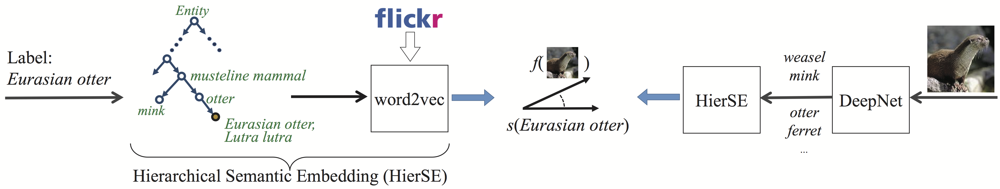

# HierSE


Given the difficulty of acquiring labeled examples for many fine-grained visual classes,
there is an increasing interest in zero-shot image tagging, aiming to tag images with novel labels that have no training examples present.
This project provides pure python (and thus cross-platform) implementation of two semantic embedding based methods for zero-shot image tagging,
namely Convex Semantic Embedding (ConSE) [1] and Hierarchical Semantic Embedding (HierSE) [2].



The key idea of zero shot learning is to introduce an intermediate layer between images and labels
such that a novel label can also be represented in this layer, even when no example of this label is supplied.
In ConSE and HierSE, this layer is implemented using a word2vec semantic space.


***Why Hierarchical Semantic Embedding?***


1. Make the label embedding more reliable, in particular for those of relatively low occurrence
2. Resolve semantic ambiguity by embedding a label into distinct vectors, depending on its given sense. This is a more fundamental advantage compared to ConSE or other semantic embedding methods where a specific tag will always be represented by the same vector, regardless of its senses. Imagine a label of multiple senses, e.g., `mouse`, which can be rat or computer mouse. 


## Dependencies

1. [numpy](www.numpy.org) 
2. [pre-trained word2vec model](http://lixirong.net/data/sigir2015/flickr4m.word2vec.tar.gz): learned from social tags of over 4 million Flickr images (flickr4m) using [Word2Vec](http://code.google.com/p/word2vec). The pre-trained model is also available at [google drive](https://drive.google.com/open?id=0B89Vll9z5OVEfnRHUWRSY0dkRjNuRVZYUGtzY0ltVTZ2bkRvSVBTRjd0akEwckVMZGV6WTQ&authuser=0). The original flickr4m tags can be downloaded [here](http://lixirong.net/data/sigir2015/flickr4m-tag.tar.gz). 


## Getting started

```Bash
git clone https://github.com/li-xirong/hierse
cd hierse/doit
./get_word2vec_model.sh 
cd ..
python test_all.py
```

Run [test\_all.py](test_all.py) to see if everything is in place. For hands-on examples, please refer to scripts in the [doit](doit) folder and the [tutorial](tutorial.md) page.

* [Use hierse and tensorflow to tag a new image](tagging-new-image.md)
* [Use hierse and pytorch to tag new images](notebooks/pytorch-for-zero-shot-learning.ipynb)


## Implementation

The process of projecting a novel label to the w2v layer is described in the `Synset2Vec` class, `PartialSynset2Vec` class in [synset2vec.py](synset2vec.py),
and the `HierSynset2Vec` class, the `HierPartialSynset2Vec` class in [synset2vec_hier.py](synset2vec_hier.py), respectively.
The four classes corresponds to four different methods (conse, conse2, hierse, hierse2) for vectorizing a WordNet synset, determined by the choice of phrase matching strategies (full match or partial match) and whether the WordNet hierarchy is considered.

1. conse: full match + no hierarchy
2. conse2: partial match + no hierarchy
3. hierse: full match + hierarchy
4. hierse2: partial match + hierarchy


The `Image2Vec` class in [im2vec.py](im2vec.py) projects an (unlabeled) image to this layer. The training label set is [ImageNet ilsvrc12\_test1k](data/synset_words_ilsvrc12_test1k.txt).
Our code assumes that probabilistic relevance score of each training label with respect to the image has been pre-computed and stored. see the provided sample set **imagenet2hop-random2k**. That said, as long as you have a pre-trained (CNN) model, e.g., [caffenet](https://github.com/BVLC/caffe/tree/master/models/bvlc_reference_caffenet) or [tensorflow series](https://github.com/tensorflow/models/tree/master/slim#Pretrained), that can predict the 1k ILSVRC12 labels, the code also works, see the [tutorial](tutorial.md) page.


Having both image and label vectorized, the `ZeroshotTagger` class in [tagger.py](tagger.py) predicts the most likely labels.


## Using your own data (images and labels)

The current version demonstrates the use of ConSE and HierSE on `imagenet2hop-random2k`, a subset of 2k images randomly selected from the whole test set of 1.3 million images. 
Most of the code is self-explained, I hope ;). Nevertheless, a bit coding is probably needed to make the code run on new data, in particular for a new training label set (`Y0`) and a new test label set (`Y1`) other than **ilsvrc12\_test1k** and **ilsvrc12\_test1k\_2hop**.

To perform zero-shot tagging on a test image set `X`:

1. Use an existing classification system to generate probabilistic relevance score of each label in `Y0` w.r.t each image in `X`. Using [txt2bin.py](simpleknn/txt2bin.py) to store the predictions in the required binary format.
2. Modify and run [do\_label2vec.sh](doit/do_label2vec.sh) to vectorize `Y0` and `Y1`.
3. Do image tagging by calling [zero\_shot\_tagging.py](zero_shot_tagging.py). 
4. Report hit@1, hit@2, hit@5, hit@10 using [evaluate.py](evaluate.py)


## References

1. Mohammad Norouzi, Tomas Mikolov, Samy Bengio, Yoram Singer, Jonathon Shlens, Andrea Frome, Greg Corrado, Jeffrey Dean, 
Zero-shot learning by convex combination of semantic embedding, ICLR, 2014
2. Xirong Li, Shuai Liao, Weiyu Lan, Xiaoyong Du, Gang Yang, [Zero-shot image tagging by hierarchical semantic embedding](http://lixirong.net/pub/sigir2015-hierse.pdf), SIGIR, 2015
