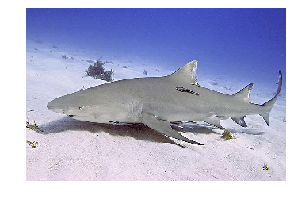

# Tagging a new image using hierse and tensorflow

## Setup

### Download the tensorflow-slim model library

```batch
mkdir $HOME/workspace
cd $HOME/workspace
git clone https://github.com/tensorflow/models/
```

### Download a pre-trained CNN model

Download a pretrained ResNet-101 from the tensorflow website


```python
from __future__ import print_function
import sys, os
sim_dir=os.path.join(os.environ['HOME'], 'workspace', 'models/slim')
sys.path.append(sim_dir)

import matplotlib.pyplot as plt
import numpy as np

import tensorflow as tf
from tensorflow.contrib import slim
# import packages defined in slim
from datasets import dataset_utils, imagenet
from nets import resnet_v2
from preprocessing import inception_preprocessing

url = "http://download.tensorflow.org/models/resnet_v2_101_2017_04_14.tar.gz"
checkpoints_dir = '/tmp/checkpoints'
model_file = os.path.join(checkpoints_dir, 'resnet_v2_101.ckpt')

if tf.gfile.Exists(model_file):
    print ('%s exists' % model_file)
else:
    if not tf.gfile.Exists(checkpoints_dir):
        tf.gfile.MakeDirs(checkpoints_dir)
    dataset_utils.download_and_uncompress_tarball(url, checkpoints_dir)
```

    /tmp/checkpoints/resnet_v2_101.ckpt exists


## Use tensorflow to obtain prediction scores for $Y_0$


```python

with tf.Graph().as_default():
    test_filename = 'lemon_shark.jpg'
    image = tf.image.decode_jpeg(tf.read_file(test_filename), channels=3)
    processed_image = inception_preprocessing.preprocess_image(image, 224, 224, is_training=False)
    processed_images  = tf.expand_dims(processed_image, 0)
    
    with slim.arg_scope(resnet_v2.resnet_arg_scope()):
        logits, _ = resnet_v2.resnet_v2_101(processed_images, num_classes=1001, is_training=False)
    probabilities = tf.nn.softmax(logits)
    
    init_fn = slim.assign_from_checkpoint_fn(
        os.path.join(checkpoints_dir, 'resnet_v2_101.ckpt'),
        slim.get_model_variables('resnet_v2_101'))
    
    with tf.Session() as sess:
        init_fn(sess)
        np_image, probabilities = sess.run([image, probabilities])
        probabilities = probabilities[0, 0:]
        sorted_inds = [i[0] for i in sorted(enumerate(-probabilities), key=lambda x:x[1])]
        
    names = imagenet.create_readable_names_for_imagenet_labels()
    for i in range(5):
        index = sorted_inds[i]
        print('Probability %0.2f%% => [%s]' % (probabilities[index] * 100, names[index]))

    plt.figure()
    plt.imshow(np_image.astype(np.uint8))
    plt.axis('off')
    plt.show()         
```

    INFO:tensorflow:Restoring parameters from /tmp/checkpoints/resnet_v2_101.ckpt
    Probability 95.09% => [tiger shark, Galeocerdo cuvieri]
    Probability 4.88% => [great white shark, white shark, man-eater, man-eating shark, Carcharodon carcharias]
    Probability 0.03% => [hammerhead, hammerhead shark]
    Probability 0.00% => [sturgeon]
    Probability 0.00% => [axolotl, mud puppy, Ambystoma mexicanum]





## Use hierse for zero-shot image tagging

First perform label2vec embeddings if not done yet:
```batch
python build_label_vec.py ilsvrc12_test1k
python build_label_vec.py ilsvrc12_test1k_2hop
```


```python
from synset2vec import Synset2Vec
from im2vec import Image2Vec
from tagger import ZeroshotTagger

i2v = Image2Vec()
s2v = Synset2Vec()
tagger = ZeroshotTagger()

score_vec = probabilities[1:]
img_embedding_vec = i2v.embedding(score_vec)
res = tagger.predict(img_embedding_vec, topk=5)
print ([(label, s2v.explain(label), score) for (label,score) in res])

for i in range(5):
    label,score = res[i]
    print('Probability %0.2f%% => [%s]' % (score * 100, s2v.explain(label)))
```

    [05 Sep 15:52:03 - bigfile.py:line 24] 1000x500 instances loaded from /Users/xirong/VisualSearch/synset2vec/ilsvrc12_test1k/flickr4m,tagvec500,hierse2
    [05 Sep 15:52:03 - im2vec.py:line 44] #active_labels=1000, embedding_size=500
    [05 Sep 15:52:03 - bigfile.py:line 24] 382298x500 instances loaded from /Users/xirong/VisualSearch/flickr4m/word2vec/tagvec500
    [05 Sep 15:52:03 - synset2vec.py:line 27] w2v(flickr4m): 382298 words, 500 dims
    [05 Sep 15:52:03 - bigfile.py:line 24] 1548x500 instances loaded from /Users/xirong/VisualSearch/synset2vec/ilsvrc12_test1k_2hop/flickr4m,tagvec500,hierse2
    [05 Sep 15:52:03 - tagger.py:line 43] #active_labels=1548, embedding_size=500


    [('n01488918', 'requiem shark', 0.90968438997970946), ('n01482330', 'shark', 0.90659676942432521), ('n01495006', 'shovelhead, bonnethead, bonnet shark, Sphyrna tiburo', 0.86355132372723176), ('n01483522', 'mackerel shark', 0.86337330763099485), ('n01494757', 'smooth hammerhead, Sphyrna zygaena', 0.73880245442257464)]
    Probability 90.97% => [requiem shark]
    Probability 90.66% => [shark]
    Probability 86.36% => [shovelhead, bonnethead, bonnet shark, Sphyrna tiburo]
    Probability 86.34% => [mackerel shark]
    Probability 73.88% => [smooth hammerhead, Sphyrna zygaena]

